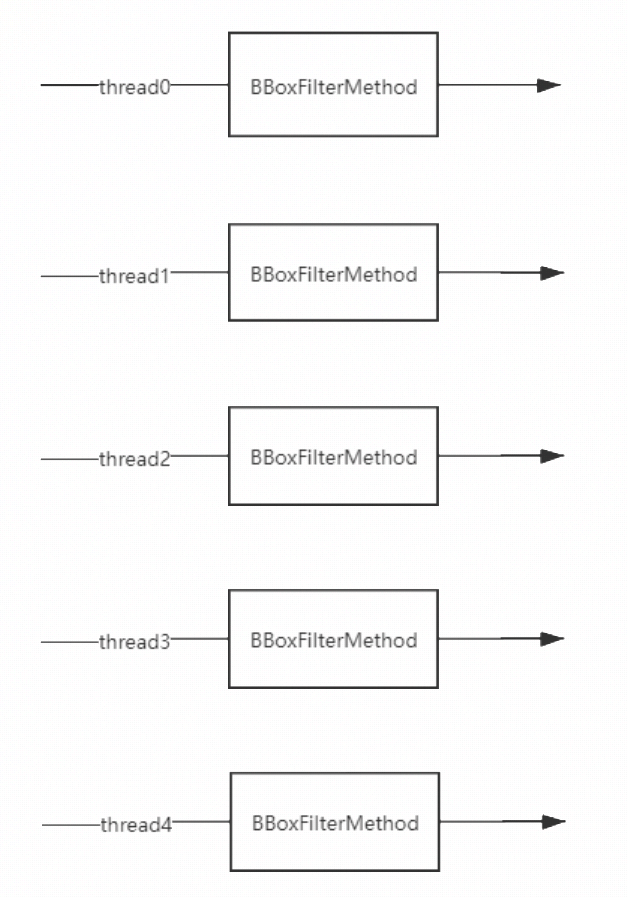

## 线程安全

### is_thread_safe_

目前method属性中，有一个is_thread_safe_字段，该字段默认值为false。
如果is_thread_safe_字段为false，表示一个method的实例只能与一个thread绑定, 也就是一个method实例对应一个thread，method和thread数量要一一对应。但是一个thread可以绑定多个不同method实例。

如果is_thread_safe_字段为true，表示一个method实例可以同时运行在多个线程上。


使用线程安全的属性，要求method本身在业务上是可重入的。如果设置了线程安全属性（is_thread_safe=true）， 即使执行该method的node设置了多个运行线程（通过thread_cout或thread_list字段，见stage2），实际只会创建一个method实例，因此如果method满足线程安全的条件，尽量设置该属性，该属性可以节省一些运行资源。




## 输入数据重排序

### is_need_reorder

有的业务场景下(例如MOT，或者其他对图像前后帧信息有严格顺序要求的场景)，method要求输入数据必须是按照顺序输入的，当数据在workflow里流动的过程中，数据的顺序经常是乱序的，此时需要对输入数据进行重新排序。此时，将需要数据是按照顺序输入的method的is_need_reorder置为true即可。

## Method属性设置

前面已经介绍了线程安全(is_thread_safe_)和输入数据重排序(is_need_reorder)的属性,下面介绍如何在xstream框架中使用is_thread_safe_和is_need_reorder属性。

### MethodInfo数据结构定义

xstream框架的Method属性是通过对MethodInfo类的各个属性成员进行赋值和使用来实现的。
MethodInfo类的数据结构定义如下：

```C++
// xstream/framework/include/hobotxstream/method.h

// Method基本信息
struct MethodInfo {
  // 是否线程安全
  bool is_thread_safe_ = false;
  // 是否需要做reorder，也就是让每一帧结果的返回顺序同请求顺序。
  bool is_need_reorder = false;
  // 是否对输入源有前后文依赖 source context dependent
  bool is_src_ctx_dept = false;
};
```

可以看到，属性is_thread_safe_默认是false，属性is_need_reorder默认是false。

### MethodInfo获取和使用

Method类(`xstream/framework/include/hobotxstream/method.h`)中定义了GetMethodInfo()成员函数。
当需要设置和使用Method属性时，直接在派生自Method的子类中对GetMethodInfo()成员函数进行重新定义即可。
MethodInfo的获取也同样通过GetMethodInfo()函数。

```C++
// xstream/framework/src/method.h
class Method {
  ...
  // 获取Method基本信息,GetMethodInfo可以被继承自Method的类子类覆盖，描述本Method所支持的属性
  virtual MethodInfo GetMethodInfo();
  ...
};

```


### 设置线程安全属性举例

以ThreadSafetyMethod类为例，描述如何设置和使用线程安全属性。
ThreadSafetyMethod类定义如下：

```C++
// xstream/tutorials/stage3/method/thread_safety_method.h
class ThreadSafetyMethod : public Method {
 public:
  int Init(const std::string &config_file_path) override;

  std::vector<std::vector<BaseDataPtr>> DoProcess(
      const std::vector<std::vector<BaseDataPtr>> &input,
      const std::vector<HobotXStream::InputParamPtr> &param) override;

  void Finalize() override;
  int UpdateParameter(InputParamPtr ptr) override;
  InputParamPtr GetParameter() const override;
  std::string GetVersion() const override;
  void OnProfilerChanged(bool on) override;
  // 设置和获取本类的MethodInfo，描述本Method支持的属性
  MethodInfo GetMethodInfo() override;
 private:
  std::atomic<int> shared_safe_value_;
};
```

ThreadSafetyMethod类的线程安全属性的设置，实现如下：

```C++
// xstream/tutorials/stage3/method/thread_safety_method.cc
MethodInfo ThreadSafetyMethod::GetMethodInfo() {
  MethodInfo order_method = MethodInfo();
  // 设置ThreadSafetyMethod为线程安全
  order_method.is_thread_safe_ = true;
  // ...
  return order_method;
}

```

按照如上设置ThreadSafetyMethod，即可使用xstream提供的线程安全属性。

ThreadSafetyMethod的功能描述：ThreadSafetyMethod每次处理输出一个sequence_id, 在设置了is_thread_safe_=true后，即使配置了多个线程，但只会创建了一个method实例，加上shared_safe_value_为一个原子变量，所以能保证每次处理都返回一个唯一的sequence_id。

### 设置输入数据重排序属性举例

以PassthroughMethod类为例，对输入数据重排序功能进行说明：
PassthroughMethod类定义如下:

```C++
// xstream/tutorials/stage3/method/passthrough_method.h
class PassthroughMethod : public Method {
 public:
  int Init(const std::string &config_file_path) override;

  std::vector<std::vector<BaseDataPtr>> DoProcess(
      const std::vector<std::vector<BaseDataPtr>> &input,
      const std::vector<HobotXStream::InputParamPtr> &param) override;

  void Finalize() override;
  int UpdateParameter(InputParamPtr ptr) override;
  InputParamPtr GetParameter() const override;
  std::string GetVersion() const override;
  void OnProfilerChanged(bool on) override;
  MethodInfo GetMethodInfo() override;
 private:
};
```

PassthroughMethod类的输入数据重排序属性的设置，实现如下：

```C++
MethodInfo PassthroughMethod::GetMethodInfo() {
  MethodInfo order_method = MethodInfo();
  order_method.is_thread_safe_ = false;
  order_method.is_need_reorder = true;
  return order_method;
}
```

按照如上设置PassthroughMethod，即可使用xstream提供的输入数据重排序属性。
在is_reorder=true的method，由于有前后帧序依赖，一般线程数设置为1。

PassthroughMethod的功能描述：PassthroughMethod功能是把输入顺序透传到输出，同上为了模拟真实应用负载，每次处理过程中随机sleep了一段时间。
